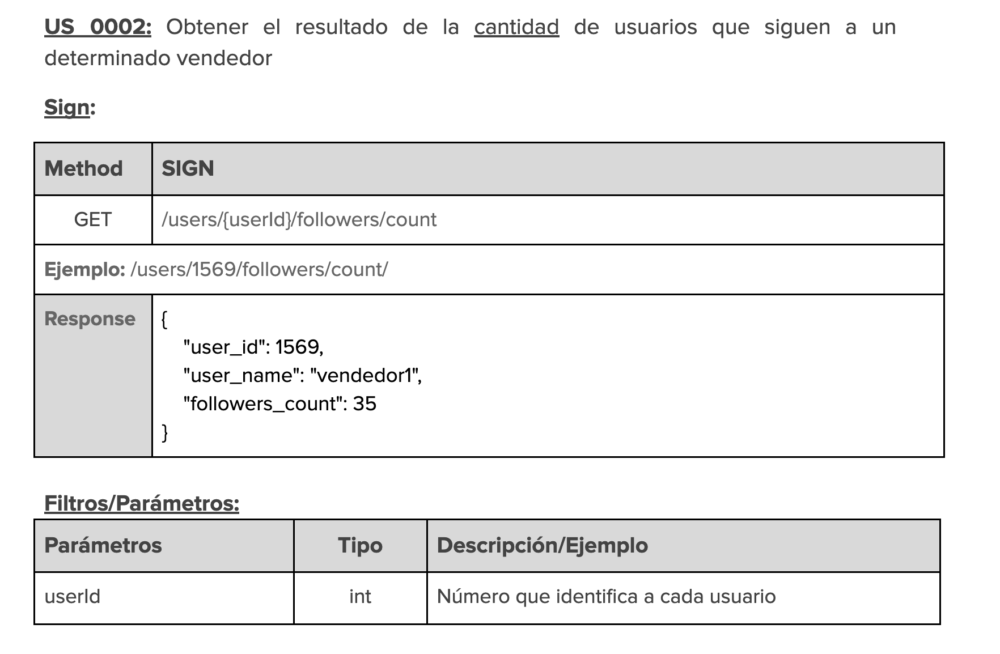
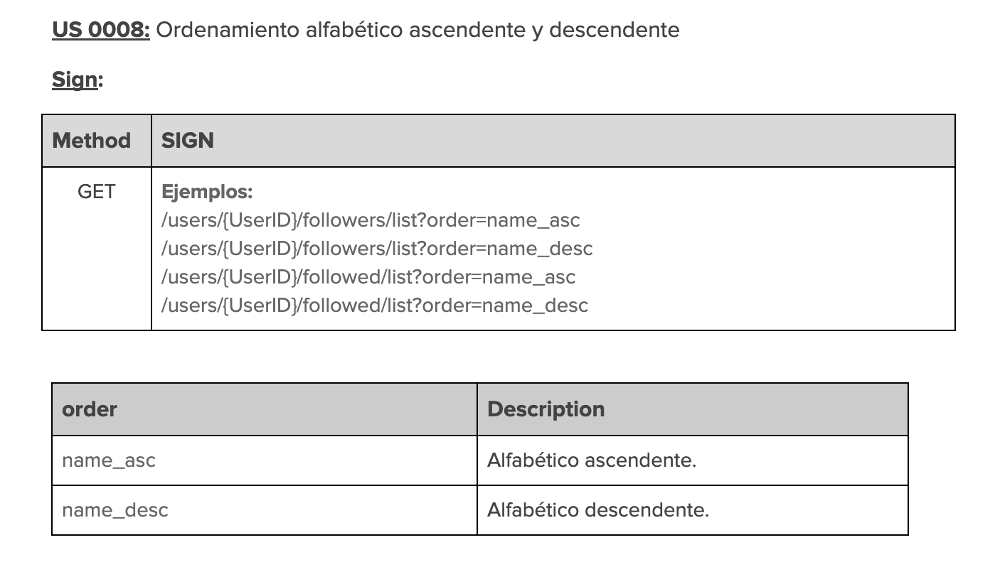

## Project information 🚀

In this project we developed a challenge set by meli that consisted of an API with certain endpoints where we were going to have users, sellers where users could follow a seller and be able to perform other types of actions.

## Compilation 💻

-Your code will be compiled this way:

If you want to run the project just download the folder and run the project with your favorite ide or from the terminal if you prefer.

##  Dependencies
- lombok
- spring-boot-devtools
- spring-boot-starter-web

### Requeriments 📌

- 1: Being able to "Follow" a specific seller 

- 2: Obtain the result of the number of users that follow a specific seller

- 3: Get a list of all the users that follow a certain seller (Who follows me?)

- 4: Obtain a list of all sellers followed by a given user (Who am I following?)

- 5: Register a new publication.

- 6: Obtain a list of the publications made in the last two weeks, by the sellers that a user follows (for this take into account sorting by date, most recent publications first).

- 7: To be able to "Unfollow" a specific seller.

- 8: Alphabetical Ascending and Descending

- 9: Date Ascending and Descending

## Endpoints

- 1: 
 

- 2: 
 

- 3: 
 

- 4: 
 

- 5: 
 

        
 

        
 

- 6: 
 

        
 

- 7: 
 

- 8: 
 

- 9: 
 

## Class Modeling

   

## Post Service

Get a post list by a followed

Create a new post

Get a post list by a followed

## Test

In the group part, the following tests were worked

- T-0001 Verificar que el usuario a seguir exista. (US-0001)
- T-0002 Verificar que el usuario a dejar de seguir exista. (US-0007)
- T-0003 Verificar que el tipo de ordenamiento alfabético exista (US-0008)
- T-0004 Verificar el correcto ordenamiento ascendente y descendente por nombre. (US-0008) 
- T-0005 Verificar que el tipo de ordenamiento por fecha exista (US-0009)
- T-0006 Verificar el correcto ordenamiento ascendente y descendente por fecha. (US-0009)
- T-0007 Verificar que la cantidad de seguidores de un determinado usuario sea correcta. (US-0002)
- T-0008 Verificar que la consulta de publicaciones realizadas en las últimas dos semanas de un determinado vendedor sean efectivamente de las últimas dos semanas. (US-0006)

In the individual part, the following tests were worked. 78% line coverage was reached

For post controller

- Creacion de un post con datos validos
- Obtener los post de un usuario valido.

For user controller
- Un usuario empieza a seguir a otro usuario
- Un usuario intenta seguirse a si mismo
- Un usuario intenta seguir a un usuario que ya sigue.
- Un usuario intenta dejar de seguir a otro usuario que no sigue
- Un usuario deja de seguir a otro usuario
- Obtener la cantidad de seguidores de un usuario
- Obtener la lista de seguidores de un usuario
- Obtener la lista de los usuarios que sigue un usuario

## Authors ✒️

    <h3 align="left"> Santiago Pinzón D </h3>
    <h3 align="left"> Edwin Gonzalez </h3>
    <h3 align="left"> Gerson Jair Sanchez </h3>
    <h3 align="left"> Josue Alexander Nunez </h3>
    <h3 align="left"> Jose Alejandro Villamizar </h3>
    <h3 align="left"> Juan Pablo Chaparro </h3>

	   